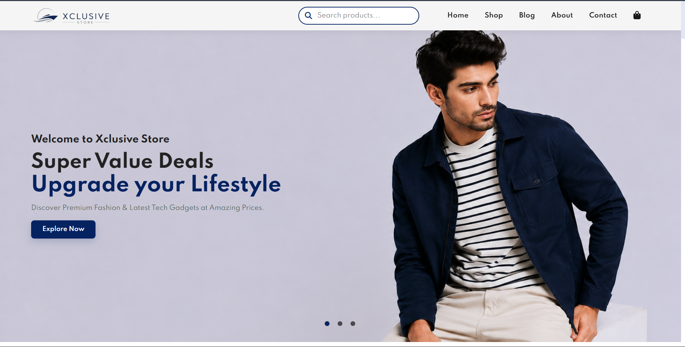

# Xclusive Store

## 📌 Project Overview

Xclusive Store is a modern and responsive e-commerce website built using HTML, CSS, and JavaScript. It provides a clean shopping experience with product browsing, product details, wishlist, shopping cart, and responsive design.

## ✨ Features

- Responsive Design
- Product Listing
- Product Details Page
- Shopping Cart
- Wishlist
- Modern UI
- Clean Navigation

## 🛠 Technologies Used

- HTML5
- CSS3
- JavaScript

## 📁 Project Structure

```
Xclusive Store/
│
├── index.html
├── shop.html
├── product.html
├── css/
├── js/
├── img/
```

## 📷 Homepage



## 🚀 How to Run

1. Download the project.
2. Open `index.html` in your browser.

## 👨‍💻 Author

**Kartik Yadav**
